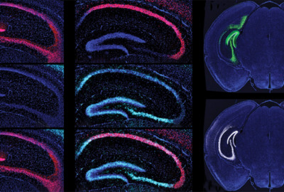

--------

 

- **FifthXenia is a creative sangha** developing modular and distributed solutions that benefit and support humanity, bolster resiliency, and deepen our **direct** relationship with the world and with each other, evolving our earthly ecosystem to that of a higher order and resonance, through the means of viscerally enspiriting, the individual, disembodied, panjandrum. 🏇
  - **We are propagators for the triratna of axioms that:**
    - 1: `The love that sustains within the worst of creation, is the birthplace of creation. The primordial you.`
    - 2: `The impersonal, is more personal, and more primordial, than the immediately personal, and any labels.`
    - 3: `Wholesome zeal propagates through curious, anewing play. Not through: more of the same, regurgitation.`
  - **There are three aspects of reality: The manifested world, natural law, and the flesh. All three should serve the spirit (liberty, truth).**
    - 1: `The Manifested World [a result]`
      - (Society < Humanity. See extreme/dense politics injected to divide over income, race, the flesh. Forever wars, forever inflating currencies, forever working, forever enlarging government deficits, forever pollution [nuclear, plastics, planned obsolesence], forever adding laws, society A versus society B instead of a (+) operation. Hostile creations [can't repair, no ownership], mandatory backdoor policies, ruled by the top, "It's just business", etc.)
    - 2: `Natural Law [a limit]`
      - (Evil cannot engulf the world, because there are the higher natural laws of morality, and of self-defense. All is not relative. All evil will not be accepted.)
    - 3: `The Flesh [a sovereign]`
      - (The flesh, if not abiding by natural law, enters a deep imbalance, of pure selfishness, immorality, and evilness. However, because of free will, one can live as the flesh, without living by it's dictates. Living in the flesh, but not being of it. Living in the world, but not being of it.)
        - (Our main focus is on enspiriting the individual panjandrum, via addressing their flesh. Society and religion will ultimately upgrade themselves, via themselves, or at the very least in part by that which we propagate.)
   

----------------

- **We are developing [piletexod.us](https://www.piletexod.us) playground (202X):** a proof-in-work sangha, individuated questing platform, and data-driven, beyond-this-world, spirit stacking mesh.

> [!CAUTION]
> What we take as our salvation and north star, can be our poison and ruin, when we refrain, and refuse, to holistically bear witness to the effects and interactions, regarding the whole.
