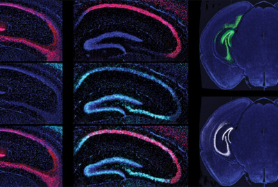

--------

 

- **FifthXenia is a creative sangha** developing modular and distributed solutions that benefit and support humanity, bolster resiliency, and deepen our **direct** relationship with the world and with each other, evolving our earthly ecosystem to that of a higher order and resonance, through the means of viscerally upgrading the individual, disembodied, panjandrum. 🏇
  - **We are propagators for the triratna of axioms that:**
    - 1: `The love that sustains within the worst of creation, is the birthplace of creation. The primordial you.`
    - 2: `The impersonal, is more personal, and more primordial, than the immediately personal, and any labels.`
    - 3: `Wholesome zeal propagates through curious, anewing play. Not through: more of the same, regurgitation.`
  - **The triratna of fetters, and false, personal, pretentious, mob-like, imbalanced idols, that we seek exodus, and refuge from (such that, we can direct our attention onto the spirit, unity, wholeness - that gleam within the eyes):**
    - 1: `Society [a system]`
      - (Society < Humanity. See extreme/dense politics, group delusions, bias, injected identity politics to divide populous over race, rich vs poor. Forever wars, forever inflating currencies, forever enlarging government deficits, forever working, forever pollution [nuclear (+ radon) + plastics (+ micro)], forever piling on laws, society A versus society B instead of a (+) operation. Bad policies, bad culture, ruled by the top, "It's just business", etc.)
    - 2: `Religion [a service]`
      - (Religion [a path] < The spirit [truth]. Religions purpose is to connect people with the spirit. If it fails to do so, it has lost its way. Also, one can get trapped in thinking religion is a tautology, the one true and only path, and live within rules and dogma, calling that god and the spirit, and the sword that pierces the heart, sanctification. Jesus said no husbands or wives in heaven, as that is of this world. We cannot take our religions with us, as they have been communicated with words, and languages, birthed of this world. Only spirit, traverses the beyond.)
    - 3: `The Flesh [a solicitor]`
      - (The flesh is an endless pit, with no bottom, insatiable wants, and immediate urgency. Fill the stomach, and sit ontop gold bars, the flesh only screams louder. We then move past mere satiation, on to conquest, visions of divine rights of kings, slaughter, more gold, punishment, retribution, revenge, sanctification of degradation. The flesh is perfectly calibrated for its needs, but we are not calibrated with respect to it - it takes us over.)
        - (Our main focus is on upgrading the individual panjandrum, via addressing their flesh. Society and religion will ultimately upgrade themselves, via themselves, or at the very least in part by that which we propagate.)
   

----------------

- **We are developing [piletexod.us](https://www.piletexod.us) (202X):** a proof-of-work sangha, individuated questing platform, and data-driven, beyond-this-world, identity-crafting mesh.
  - Nothing more said, until we release our MVP...
<blockquote>Our medicines and north stars, can ultimately become our poisons and ruins, if we refrain, and refuse, to holistically bear witness to our effects and interactions, regarding the whole.</blockquote>
